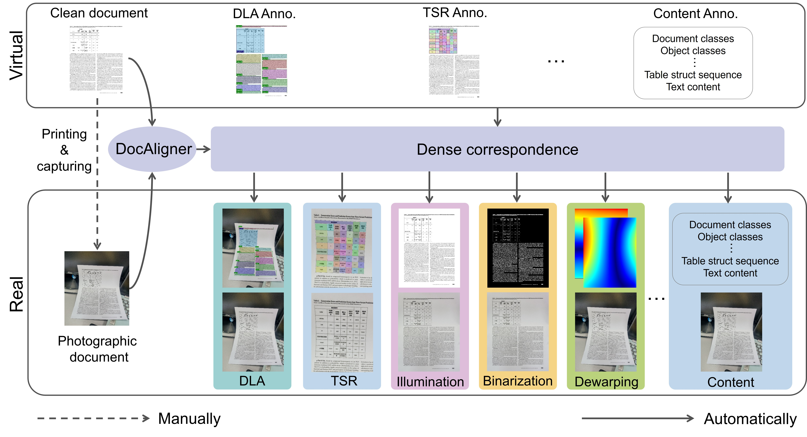

🔥 A comprehensive recommendation for Document Image Processing is available at [here](https://github.com/ZZZHANG-jx/Recommendations-Document-Image-Processing).

# DocAligner 
This repository contains the codes for [**DocAligner**](https://arxiv.org/abs/2306.05749).
<p align="center">
  
</p>
<!-- 
## environment
```
conda env create -f environment.yml
```
The correlation layer is implemented in CUDA using CuPy, so CuPy is a required dependency. It can be installed using pip install cupy or alternatively using one of the provided binary packages as outlined in the CuPy repository. The code was developed using Python 3.7 & PyTorch 1.11 & CUDA 11.2, which is why I installed cupy for cuda112. For another CUDA version, change accordingly.
```
pip install cupy-cuda112 --no-cache-dir
``` -->

<!-- ## Training
```
train_efficient.py
``` -->


<!-- ## Inference
1. Weight preparation: The weights for non-rigid pre-alignment (pre.pkl) and hierarchical alignment (ha.pkl) can be downloaded [**here**](xxx).  
  
2. Data preparation: Source and target images need to be put in `./data/dataset_folder`. The names of source captured images should end with `_origin`, while names of target clean images should end with `_target`. The names of paired source and target should be the same except for the different name endings.

3. Perform non-rigid pre-alignment
```
python ./data/preprocess/MBD/infer.py --im_folder ./data/dataset_folder
```
3. Inference. Note that we offer 3 modes, which are 1: no self-supervision, 2: self-supervised optimization for each image separately, and 3: self-supervised optimization for the whole dataset. Mode 2 works best but is very time consuming, mode 3 is a compromise between performance and efficiency. 
```
python infer_test_time_optimize.py --mode 2 --im_folder ./data/dataset_folder
```
4. Obtain final grid based on grid from step 2 and 3. Such final grid correlates the source target clean image toward the source captured image.
```
python tools/sum_backwardmap.py --im_folder ./data/dataset_folder
```  
5. Utilization of final grid . Annotation transform (COCO format): Please refer to `tools/annotate_transform.py`. We also provide a script for COCO data visualization: `tools/coco_visualize.py`; Dewarping: We provide a script for dewarping the source captured image based on the final grid: `tools/dewarp.py` -->


## DocAligner-acquired Dataset
The dataset mentioned in our paper, obtained using DocAligner, for document layout analysis, table structure recognition, illumination correction, binarization and geometric rectification tasks can be downloaded [**here**](https://1drv.ms/f/s!Ak15mSdV3Wy4iOdLD3VCxzSeC82mJg?e=afLUBP).


## Citation
If you are using our code and data, please consider citing our paper.
```
@article{zhang2023docaligner,
title={DocAligner: Annotating Real-world Photographic Document Images by Simply Taking Pictures},
author={Zhang, Jiaxin and Chen, Bangdong and Cheng, Hiuyi and Guo, Fengjun and Ding, Kai and Jin, Lianwen},
journal={arXiv preprint arXiv:2306.05749},
year={2023}}
```

<!-- ## Training
@article{zhang2023docaligner,
title={Boosting Document Intelligence in Photographed Scenarios by Real-virtual Alignment},
author={Zhang, Jiaxin and Chen, Bangdong and Peng, Dezhi and Cheng, Hiuyi and Guo, Fengjun and Ding, Kai and Jin, Lianwen},
year={2023}}
-->
